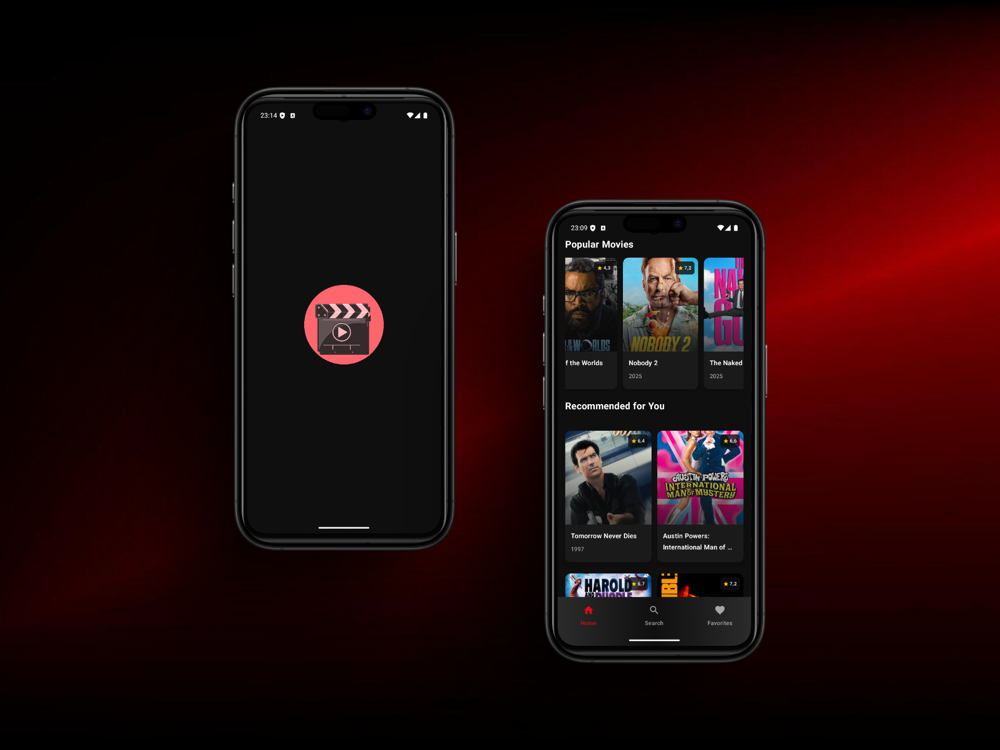
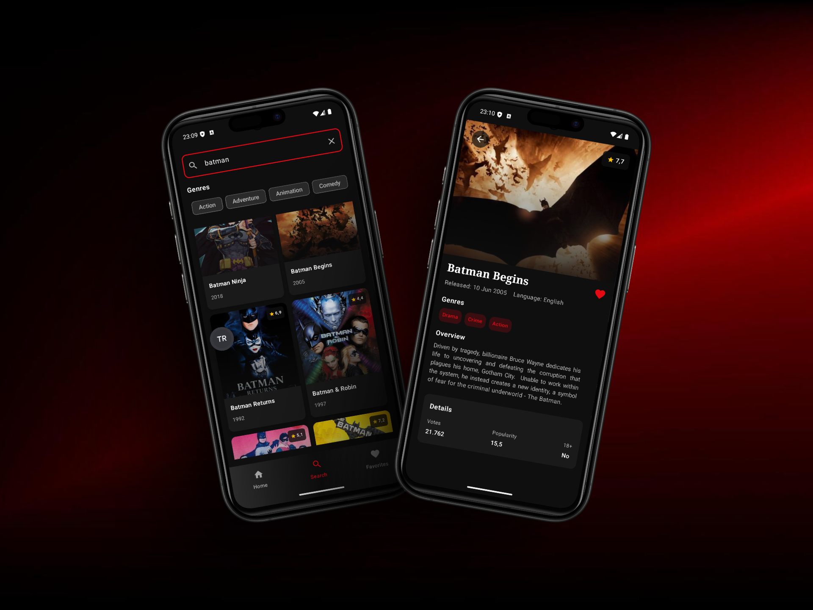
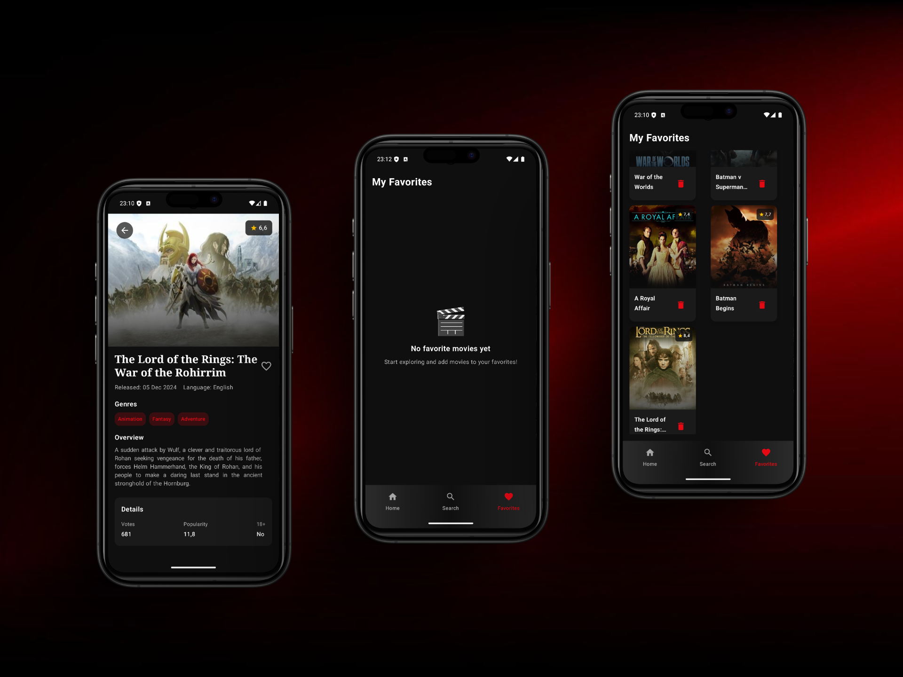

# MovieGuide 🎬

**MovieGuide** is a modern Android movie discovery application that provides users with comprehensive movie information from The Movie Database (TMDB). Built with cutting-edge Android development technologies, it offers an intuitive way to explore popular films, search for specific movies, and manage personal favorites with a sleek, cinema-inspired interface.

## 📸 Screenshots







## ✨ Features

* 🎭 **Movie Discovery**: Browse popular and recommended movies with stunning visuals
* 🔍 **Advanced Search**: Find movies by title with genre-based filtering system
* ❤️ **Favorites Management**: Save and organize your favorite movies locally
* 🎨 **Detailed Movie Information**: View comprehensive movie details including ratings, genres, and overviews
* 📱 **Modern UI**: Beautiful interface built with Jetpack Compose and Material Design 3
* 🌙 **Dark Theme**: Cinema-inspired dark color scheme with gradient navigation
* 🎬 **Animated Splash Screen**: Engaging Lottie animation on app startup
* 📶 **Pull-to-Refresh**: Swipe down to refresh movie lists
* 🔄 **Real-time Updates**: Instant UI updates with reactive programming

## 🛠️ Tech Stack

* **Jetpack Compose** - Modern declarative UI toolkit
* **MVVM + Clean Architecture** - Structured development pattern with separation of concerns
* **Dagger Hilt** - Dependency injection framework
* **Room Database** - Local data persistence for favorites
* **Retrofit + OkHttp** - HTTP client for API communication
* **Coroutines + Flow** - Asynchronous programming and reactive streams
* **Navigation Compose** - Type-safe navigation between screens
* **Material Design 3** - Latest Material Design components
* **Coil** - Efficient image loading and caching
* **Lottie** - Smooth vector animations for enhanced user experience

## 🌐 API Integration

The app integrates with **The Movie Database (TMDB) API** to fetch movie data. To run the app, you need to obtain API credentials from TMDB.

### Setting up API Keys

1. Get your API key and access token from [TMDB](https://www.themoviedb.org/settings/api)

2. Create a `local.properties` file in your project root directory

3. Add your credentials:
   ```properties
   TMDB_API_KEY=your_api_key_here
   TMDB_ACCESS_TOKEN=your_access_token_here
   ```

4. The app uses BuildConfig to securely access these credentials:
   ```kotlin
   val localProperties = Properties()
   val localPropertiesFile = rootProject.file("local.properties")
   if (localPropertiesFile.exists()) {
       localPropertiesFile.inputStream().use { localProperties.load(it) }
   }

   buildConfigField("String", "TMDB_API_KEY", "\"${localProperties.getProperty("TMDB_API_KEY")}\"")
   buildConfigField("String", "TMDB_ACCESS_TOKEN", "\"${localProperties.getProperty("TMDB_ACCESS_TOKEN")}\"")
   ```

## 🏗️ Architecture

The app follows **Clean Architecture** principles with clear separation of concerns:

* **Data Layer**: API services, DTOs, repositories, and Room database
* **Domain Layer**: Use cases, business logic, and domain models
* **Presentation Layer**: ViewModels, Compose screens, and UI components

### Architecture Components

* **Repository Pattern** - Centralized data management
* **Use Cases** - Encapsulated business logic
* **State Management** - Reactive UI state with StateFlow
* **Dependency Injection** - Modular architecture with Hilt

## 📱 Screens

* 🎬 **Splash Screen** - Animated app introduction with Lottie
* 🏠 **Home Screen** - Popular movies (horizontal) and recommendations (grid)
* 🔍 **Search Screen** - Movie search with genre filtering
* ❤️ **Favorites Screen** - Locally saved favorite movies with remove functionality
* 📄 **Movie Detail Screen** - Comprehensive movie information with favorite toggle

## 🎨 Key Components

* **Movie Cards** - Beautiful movie posters with ratings and titles
* **Genre Filters** - Interactive chips for movie categorization
* **Pull-to-Refresh** - Smooth refresh functionality
* **Loading States** - Elegant loading indicators and error messages
* **Gradient Navigation** - Cinema-inspired bottom navigation bar

## 🔧 Getting Started

1. Clone the repository
   ```bash
   git clone https://github.com/yourusername/movieguide-android.git
   ```

2. Get TMDB API credentials from [TMDB API](https://www.themoviedb.org/settings/api)

3. Create `local.properties` file with your credentials

4. Open in Android Studio

5. Sync project with Gradle files

6. Run the app

## 📦 Dependencies

**Core**: Jetpack Compose, Material 3, Activity Compose, Navigation Compose  
**Architecture**: Dagger Hilt, ViewModel, Lifecycle Components, Room Database  
**Networking**: Retrofit, OkHttp, Gson Converter  
**Images**: Coil Compose for efficient image loading  
**Animation**: Lottie Compose, Accompanist SwipeRefresh  
**Async**: Kotlin Coroutines, Flow  
**UI**: Material Icons Extended  

## 🌟 Key Features Explained

### Movie Discovery
Browse through popular movies fetched from TMDB with horizontal scrolling, plus personalized recommendations in a grid layout.

### Smart Search
Real-time movie search with additional genre filtering options. Users can search by title and filter results by multiple genres simultaneously.

### Favorites System
Local storage of favorite movies using Room database. Add/remove movies from favorites with instant UI feedback.

### Modern UI/UX
- Dark theme optimized for movie browsing
- Smooth animations and transitions
- Responsive design with proper loading states
- Pull-to-refresh functionality
- Gradient navigation bar

## 🔒 Security

* API keys stored securely in local.properties (not in version control)
* BuildConfig used for secure credential access
* Network security with HTTPS only
* No sensitive user data collection

## 🤝 Contributing

Contributions are welcome! Please feel free to submit a Pull Request. For major changes, please open an issue first to discuss what you would like to change.

1. Fork the Project
2. Create your Feature Branch (`git checkout -b feature/AmazingFeature`)
3. Commit your Changes (`git commit -m 'Add some AmazingFeature'`)
4. Push to the Branch (`git push origin feature/AmazingFeature`)
5. Open a Pull Request

## 📄 License

This project is licensed under the MIT License - see the [LICENSE](LICENSE) file for details.

## 👨‍💻 Developer

**Altan Koç**
* GitHub: [@altanbkoc](https://github.com/altanbkoc)

## 🙏 Acknowledgments

* **TMDB** for providing the comprehensive movie database API
* **Material Design** for the beautiful design system
* **Jetpack Compose** team for the modern UI toolkit

---

⭐ **If you found this project helpful, please give it a star!** ⭐

---

*Built with ❤️ using Kotlin and Jetpack Compose*
